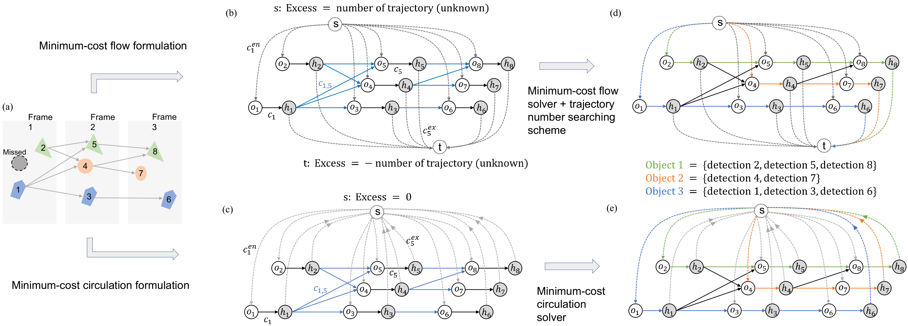
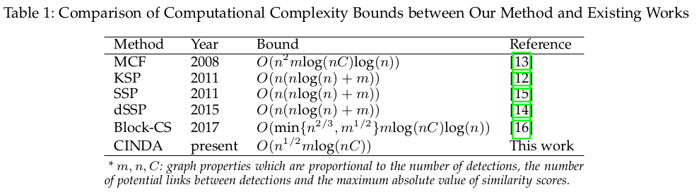
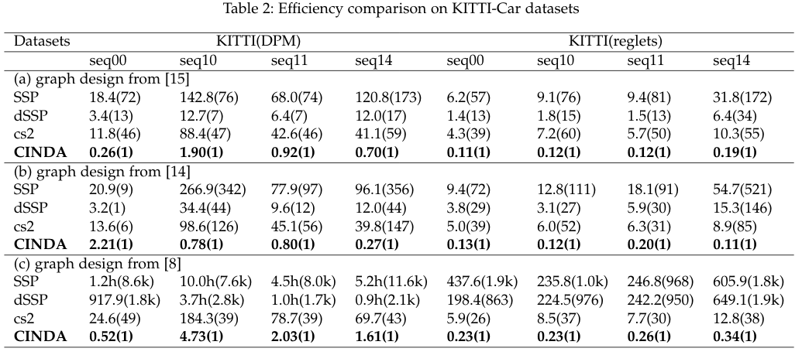
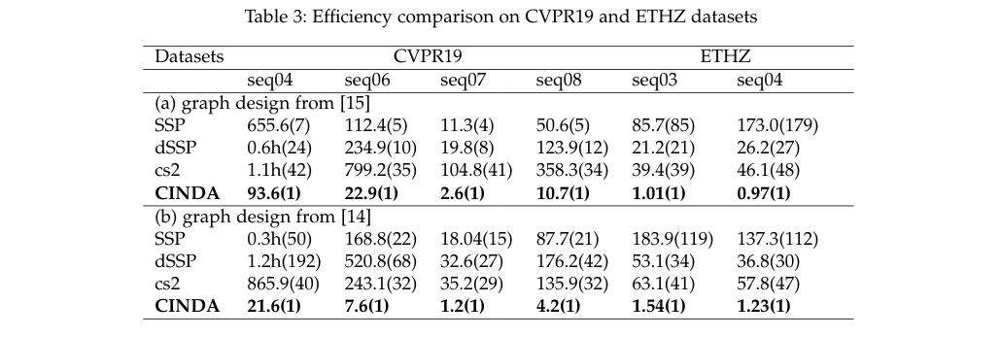
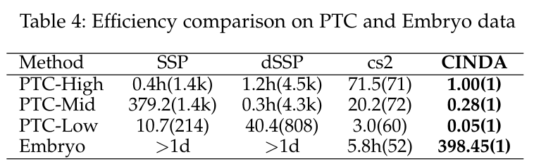
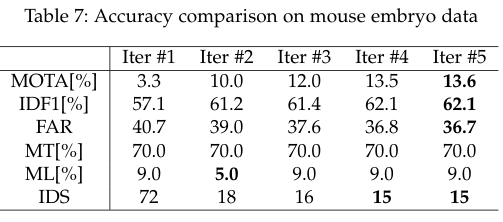

# Welcome to CINDA
CINDA (**CI**rculation **N**etwork based **D**ata-**A**ssociation) is a minimum-cost circulation framework for solving the global data association problem, which plays a key role in the tracking-by-detection paradigm of multi-object tracking (MOT). CINDA maintains the same optimal solution as the previously widely used minimum-cost flow framework, while enjoys both a better theoretical complexity bound and orders of practical efficiency improvement. The improved computational efficiency is expected to enable more sophisticated tracking framework and yields better tracking accuracy.

If you have any feedback or issue, you are welcome to either post issue in Issues section or send email to yug@vt.edu (Guoqiang Yu at Virginia Tech).
#

## Overview of CINDA and its comparison with minmum-cost flow-based framework


(a) Objects detected in three consecutive frames. The first frame contains two detections; one missed detection is colored in gray. Lines between detections are the possible ways of linking them. Each line is associated with a cost. If the similarity between two detections is too low to be the same object, we do not link them. There are three trajectories in these three frames. For example, detections 1, 3, and 6 should be linked together as a single trajectory. (b) The proposed minimum-cost circulation formulation for the MOT problem. Detection $x_i$ is represented by a pair of nodes: a pre-node $o_i$ and a post-node $h_i$. The dummy node $s$ is linked to all pre-nodes. Then all post-nodes are linked back to $s$. These edges are shown in dashed lines. Transition edges between detections are shown in blue. Similar to (a), there is no transition edge if the similarity between detections is too low. The input and output flows of every node in the circulation network are balanced. Therefore, the excess for the dummy node is always 0. % and we do not need to specify the expected amount of flow in the network, which is the expected number of tracking targets. (c) Typical minimum-cost flow formulation for MOT problem. Each detection is also represented by a pre-node and post-node. The difference is that in this flow network, there are two dummy nodes: the dummy source node $s$ is linked to all pre-nodes $\{o_i\}$  and the dummy sink node $t$ is linked to the post-nodes $\{h_i\}$. The color-coding is the same as that in (b). The input and output flows of these two dummy nodes are both imbalanced and the amount of imbalances decide how many targets we want to track (the amount of flow that can happen in the network). To apply existing minimum-cost flow solvers, we need to specify the excess and deficit of $s$ and $t$ first, which is commonly unknown. (d) The results from the proposed minimum-cost circulation framework. Three trajectories are created and they are shown with the same color as in (a). The solution can be obtained by any minimum-cost circulation solver. (e) The results from the minimum-cost flow formulation. The same three trajectories are generated. In addition to a minimum-cost flow solver, an accompanying searching scheme is needed to find the optimal trajectory number, or equivalently, the optimal flow amount.

# Supports to Python and MATLAB
CINDA was implemented using C based on the efficient implementation of cost-scaling algorithm[1]. Interfaces for Python and MATLAB are also provided respectively, on which the efficiency is also guaranteed. Try CINDA now!

Any problem? CINDA does not work on your data? Please open an issue. We are happy to help!

# Efficiency comparison
## Theoretical bounds compared with minimum-cost flow-based methods
<p align="center">
  
</p>


## Pracitical efficiency comparisons with minimum-cost flow-based methods

### Experiments on natural image benchmarks
<p align="center">
  
</p>
<p align="center">
  
</p>

### Experiments on microscopy imaging data for particle and cell tracking
<p align="center">
  
</p>

# Case studies using CINDA
1. CINDA makes it possible to do identity inference using more history frames, which retrieve identities of occluded objects

2. CINDA enable us to iteratively refine tracking results on larger scale data (see Table 4)
<p align="center">
  
</p>

# Cite
## Please cite our paper if you find the code useful for your research.
Congchao Wang, Yizhi Wang, Guoqiang Yu, [Efficient Global Multi-object Tracking Under Minimum-cost Circulation Framework](https://ieeexplore.ieee.org/document/9204816), 	arXiv:1911.00796. (accepted by IEEE Trans. on PAMI)
```
@article{cinda_mot,
  title={Efficient Global Multi-object Tracking Under Minimum-cost Circulation Framework},
  author={Wang, Congchao and Wang, Yizhi and Yu, Guoqiang},
  journal={arXiv preprint arXiv:1911.00796},
  year={2019}
}
```
# Reference
[1].Goldberg, A. V. (1997). An efficient implementation of a scaling minimum-cost flow algorithm. Journal of algorithms, 22(1), 1-29.

[8] S. Sharma, J. A. Ansari, J. K. Murthy, and K. M. Krishna, “Beyond
pixels: Leveraging geometry and shape cues for online multiobject tracking,” in 2018 IEEE International Conference on Robotics
and Automation (ICRA). IEEE, 2018, pp. 3508–3515.

[12] J. Berclaz, F. Fleuret, E. Turetken, and P. Fua, “Multiple object
tracking using k-shortest paths optimization,” IEEE transactions
on pattern analysis and machine intelligence, vol. 33, no. 9, pp. 1806–
1819, 2011.

[13] L. Zhang, Y. Li, and R. Nevatia, “Global data association for multiobject tracking using network flows,” in 2008 IEEE Conference on
Computer Vision and Pattern Recognition. IEEE, 2008, pp. 1–8.

[14] P. Lenz, A. Geiger, and R. Urtasun, “Followme: Efficient online
min-cost flow tracking with bounded memory and computation,”
in Proceedings of the IEEE International Conference on Computer
Vision, 2015, pp. 4364–4372.

[15] H. Pirsiavash, D. Ramanan, and C. C. Fowlkes, “Globally-optimal
greedy algorithms for tracking a variable number of objects,” in
CVPR 2011. IEEE, 2011, pp. 1201–1208.

[16] A. V. Goldberg, S. Hed, H. Kaplan, and R. E. Tarjan, “Minimum-cost flows in unit-capacity networks,” Theory of Computing Systems,
vol. 61, no. 4, pp. 987–1010, 2017.

# Updates

1) Sep.2020: Add the support to problems where detections can be shared across different trajectories.

2) Nov.2020: Add support to python 64bit on Windows system (compiled by Mingw-w64 in Cygwin64).
